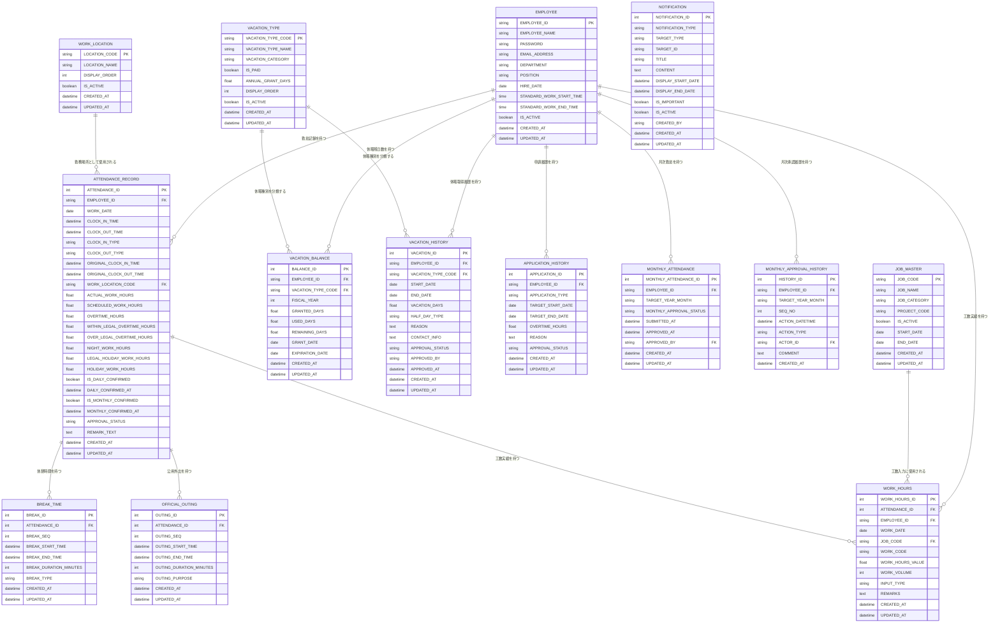

# TeamSpirit勤怠管理システム

## ER図

## 変更履歴

| 日付 | 変更内容 | 変更者 |
|------|----------|--------|
| 2025-11-27 | 初版作成 | sugakana |
| 2025-12-08 | 月次勤怠（MONTHLY_ATTENDANCE）と月次承認履歴（MONTHLY_APPROVAL_HISTORY）を追加。EMPLOYEEとの関係を追加 | AI Assistant |
| 2025-12-08 | 申請履歴（APPLICATION_HISTORY）を追加。EMPLOYEEとの関係を追加 | AI Assistant |
| 2025-12-09 | ATTENDANCE_RECORDにORIGINAL_CLOCK_IN_TIME、ORIGINAL_CLOCK_OUT_TIME、WITHIN_LEGAL_OVERTIME_HOURS、OVER_LEGAL_OVERTIME_HOURS、LEGAL_HOLIDAY_WORK_HOURSを追加。VACATION_HISTORYにCONTACT_INFOを追加 | AI Assistant |

